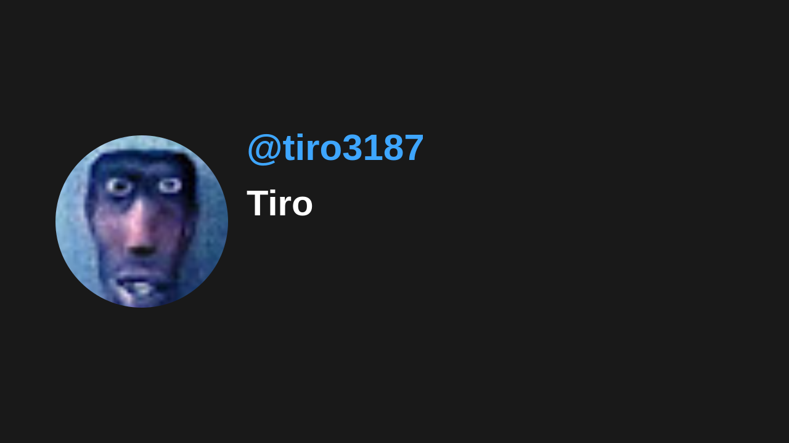

# 🎥 Youtube Thumbnail

YoutubeThumbnail is a project that transforms the latest comment on a YouTube video into its thumbnail. A creative and interactive way to engage your viewers!

## 🎬 Demo

Access the video here:

## 🎴 Last Thumbnail

## 🚀 Features

- Captures the latest comment from a YouTube video
- Censures the comment using AI
- Automatically converts this comment into a thumbnail image using javascript and canvas
- Updates the video thumbnail with the selected comment every 20 minutes via GitHub Actions
- Creates an interactive experience where viewers can influence the appearance of the video
- Fully automated: updates thumbnail and commits changes every 20 minutes

## 🔧 Usage

Just fork this repo and configure it with your own credentials:

1. Clone the repository to your local machine
2. Create a `.env` file with the following variables:

   - `YOUTUBE_API_KEY` - Your YouTube Data API key
   - `YOUTUBE_VIDEO_ID` - The ID of your YouTube video to monitor
   - `GEMINI_API_KEY` - Your Google Gemini API key for content moderation
   - `GOOGLE_CLIENT_ID` - Your Google Console client ID
   - `GOOGLE_CLIENT_SECRET` - Your Google Console client secret
   - `GOOGLE_ACCESS_TOKEN` - Your OAuth access token
   - `GOOGLE_REFRESH_TOKEN` - Your OAuth refresh token

3. Set up GitHub repository secrets with the same variables
4. The GitHub Actions workflow will automatically run every 20 minutes to:
   - Check for new comments
   - Update the thumbnail
   - Commit changes to the repository

Remember to set up the appropriate permissions in Google Cloud Console for YouTube Data API and provide the necessary OAuth scopes for your application.

## 🤙 Thanks!

This code sucks! Enjoy it!
